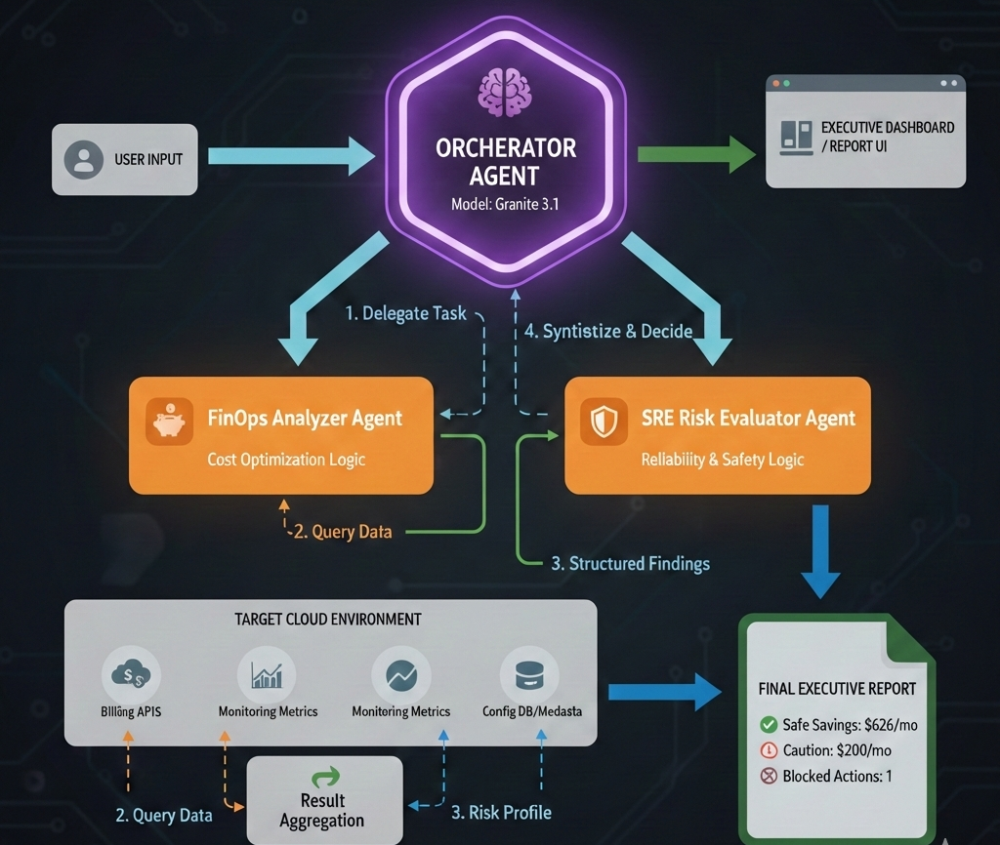
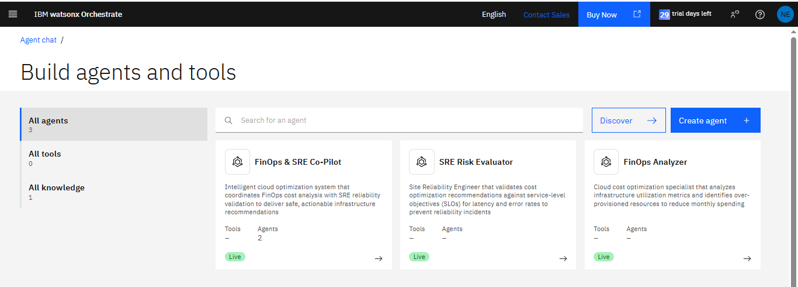
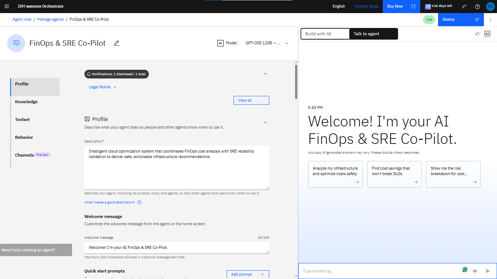
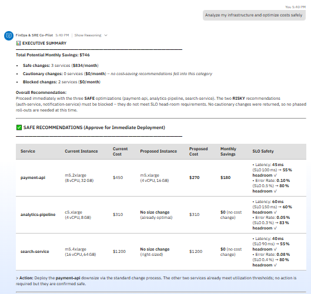
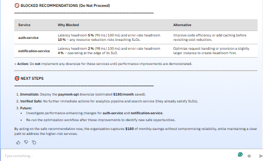
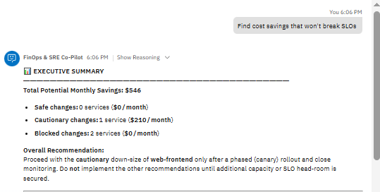
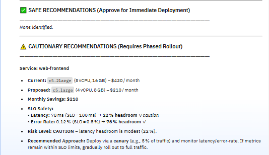
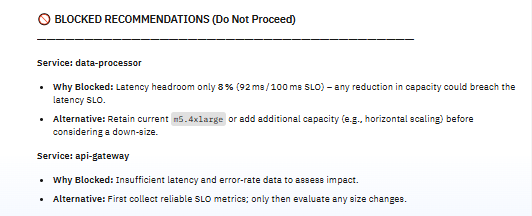

# AI FinOps & SRE Co-Pilot  
> **IBM Dev Day – AI Demystified Hackathon 2026**

🔍 *Optimize cloud costs without breaking production.*

An **agentic AI system** that analyzes cloud infrastructure **cost + performance metrics** and recommends **safe, SLO-aware optimizations** — inspired by real **FinOps & SRE practices at Google and Amazon**.

Built using **IBM watsonx Orchestrate** and **IBM Granite 3.1**.

---

## 🎯 Problem Statement

Cloud costs are increasing **20–30% every year**, but organizations struggle to optimize because:

- ❌ Aggressive cost-cutting breaks production systems  
- ❌ Manual analysis is slow and error-prone  
- ❌ Cost vs reliability trade-offs are unclear  
- ❌ Engineers fear SLO violations  

💥 **The real risk:** outages, SLO breaches, customer impact, and revenue loss.

---

## 💡 Solution Overview

<p align="center">
A <b>multi-agent AI system</b> that behaves like a real cloud operations team.
</p>

<table>
<tr>
<td width="33%" valign="top">

### 🟦 FinOps Analyzer Agent

<ul>
<li>Analyzes CPU & memory utilization</li>
<li>Detects over-provisioned resources</li>
<li>Recommends right-sizing actions</li>
<li>Estimates monthly cost savings</li>
</ul>

</td>
<td width="33%" valign="top">

### 🟩 SRE Risk Evaluator Agent

<ul>
<li>Reviews FinOps recommendations</li>
<li>Analyzes latency & error-rate SLOs</li>
<li>Classifies changes as:
  <ul>
    <li>✅ SAFE</li>
    <li>⚠️ CAUTION</li>
    <li>🚫 RISKY</li>
  </ul>
</li>
<li>Blocks risky production changes</li>
</ul>

</td>
<td width="33%" valign="top">

### 🟨 Orchestrator (FinOps & SRE Co-Pilot)

<ul>
<li>Coordinates all agents</li>
<li>Synthesizes executive-level reports</li>
<li>Balances <b>cost efficiency + reliability</b></li>
<li>Produces clear, actionable decisions</li>
</ul>

</td>
</tr>
</table>


## 🏗️ System Architecture

<table align="center" width="80%" border="1" cellpadding="12" cellspacing="0" style="border-color:#d0d7de;">
  <tr>
    <td align="center" bgcolor="#f6f8fa">
      
      <br/><br/>
    </td>
  </tr>
</table>
<br/>

---
## 📸 Demo Screenshots

<!-- Multi-Agent Configuration -->
### 🔹 Multi-Agent Configuration

<table align="center" width="80%" border="1" cellpadding="12" cellspacing="0" style="border-color:#d0d7de;">
  <tr>
    <td align="center" bgcolor="#f6f8fa">
      
      <br/><br/>
      <b>🧠 Multi-Agent Configuration</b>
    </td>
  </tr>
</table>

<br/>

---

<!-- Orchestrator ↔ Agent Conversation -->
### 🔹 Orchestrator ↔ Agent Conversation
<table align="center" width="80%" border="1" cellpadding="12" cellspacing="0" style="border-color:#d0d7de;">
  <tr>
    <td align="center" bgcolor="#f6f8fa">
      
      <br/><br/>
      <b>🎛️ Main Orchestrator View</b>
    </td>
  </tr>
</table>
<br/>

---
<table width="100%" border="1" cellpadding="10" cellspacing="0" style="border-color:#d0d7de;">
 <tr bgcolor="#f6f8fa">
    <td align="center" width="50%">
      
      <br/><br/>
      <b>💰 FinOps Analyzer Interaction</b>
    </td>
    <td align="center" width="50%">
      
      <br/><br/>
      <b>🛡️ SRE Risk Evaluator Interaction</b>
    </td>
  </tr>
</table>

<br/>

---

<!-- Executive Summary -->
### 🔹 Executive Summary Output

<table align="center" width="85%" border="1" cellpadding="12" cellspacing="0" style="border-color:#d0d7de;">
  <tr>
    <td align="center" bgcolor="#f6f8fa">
      
      <br/><br/>
      <b>📊 Executive Summary Output</b>
    </td>
  </tr>
</table>

<br/>

---

<!-- Safe vs Blocked -->
### 🔹 Optimization Decisions Overview

<table width="100%" border="1" cellpadding="10" cellspacing="0" style="border-color:#d0d7de;">
  <tr bgcolor="#f6f8fa">
    <td align="center" width="50%">
      
      <br/><br/>
      <b>✅ Safe Cost Optimizations</b>
    </td>
    <td align="center" width="50%">
      
      <br/><br/>
      <b>🚫 Blocked Risky Change</b>
    </td>
  </tr>
</table>

---


## 📊 Results

**Analyzed Environment**
- 10 cloud services (auth, payment, analytics, dashboards)
- Mixed utilization (20–90%)
- Strict latency & error SLOs

| Category | Services | Monthly Savings | Status |
|--------|----------|-----------------|--------|
| ✅ SAFE | 3 | $626/month | Deploy immediately |
| ⚠️ CAUTION | 2 | $200/month | Canary rollout |
| 🚫 RISKY | 1 | $0 | Blocked |

💡 **Total Potential Savings:** **$826/month (~40%)**

🚨 **Key Win:**  
The system automatically **blocked a risky downsizing** of `auth-service` operating at **94% of latency SLO**, preventing a potential production outage.

---

## 🧠 Example System Output

```text
EXECUTIVE SUMMARY
━━━━━━━━━━━━━━━━━━━━━━━━━━━━━━
Total Monthly Savings: $826

Safe changes: 3 services ($626)
Caution changes: 2 services ($200)
Blocked changes: 1 service

Recommendation:
Deploy safe optimizations immediately.
Use phased canary deployments for caution items.
```
## 🛠️ Technical Stack

- **Platform:** IBM watsonx Orchestrate
- **AI Model:** IBM Granite 3.1 8B Instruct
- **Framework:** Multi-agent orchestration
- **Data:** Mock cloud infrastructure metrics (CSV)
- **Concepts:** FinOps, SRE, SLO management, risk classification

## 📁 Repository Structure
```
ai-finops-sre-copilot/
├── README.md
├── data/
│   └── cloud_infrastructure_metrics.csv
├── docs/
│   ├── architecture.md
│   └── agent-instructions.md
└── screenshots/
    ├── 01-three-agents.png
    ├── 02-orchestrator-conversation.png
    ├── 02-orchestrator-conversation_1.png
    ├── 02-orchestrator-conversation_2.png
    ├── 03-executive-summary.png
    ├── 04-safe-recommendations.png
    └── 05-blocked-risky-change.png


```
---
## 🎓 What I Learned

<p align="center">
Key engineering principles reinforced while building a <b>production-grade, agentic AI system</b>.
</p>

<table>
<tr>

<td width="33%" valign="top">

### 🧠 Multi-Agent Systems

<ul>
<li>Separation of concerns improves system reliability</li>
<li>Agent orchestration enables complex, end-to-end workflows</li>
<li>Specialized agents outperform general-purpose prompts</li>
</ul>

</td>

<td width="33%" valign="top">

### 💰 FinOps Principles

<ul>
<li>Utilization monitoring reveals infrastructure waste</li>
<li>Right-sizing requires domain and workload context</li>
<li>Cost optimization is continuous, not one-time</li>
</ul>

</td>

<td width="33%" valign="top">

### 🛡️ SRE Best Practices

<ul>
<li>SLOs define acceptable reliability boundaries</li>
<li>Headroom analysis prevents production incidents</li>
<li>Phased rollouts reduce blast radius</li>
<li>Automated safety checks prevent human error</li>
</ul>

</td>

</tr>
</table>


---
## 🌟 Real-World Applications

This pattern can be extended to:

- **Kubernetes cluster optimization** - Right-size pods, optimize resource requests
- **Database cost management** - Balance IOPS, storage, and query performance
- **Auto-scaling optimization** - Tune scaling policies against traffic patterns
- **Multi-cloud cost governance** - Compare pricing across AWS, Azure, GCP

## 🏆 Hackathon Impact

This project demonstrates:

✅ **Technical depth** - Multi-agent AI orchestration  
✅ **Business value** - $826/month savings for a 10-service environment  
✅ **Production readiness** - SLO monitoring, risk classification, deployment strategies  
✅ **Real-world thinking** - Mirrors how Google/Amazon manage infrastructure  

**Theme alignment:** "AI Demystified - From idea to deployment"
- Shows how approachable AI can simplify complex cloud operations
- Demonstrates practical AI that teams can deploy immediately
- Proves AI can make technical decisions confidently and safely

## 👨‍💻 Author
- GitHub: [Neha-Erigidindla](https://github.com/Neha-Erigidindla)
- Hackathon: IBM Dev Day AI Demystified 2026

## 🙏 Acknowledgments

- IBM watsonx team for the orchestration platform
- IBM Granite model team for high-quality inference
- Cloud FinOps Foundation for cost optimization frameworks
- Google SRE book for reliability engineering principles

---

**Built for the IBM Dev Day AI Demystified Hackathon**
